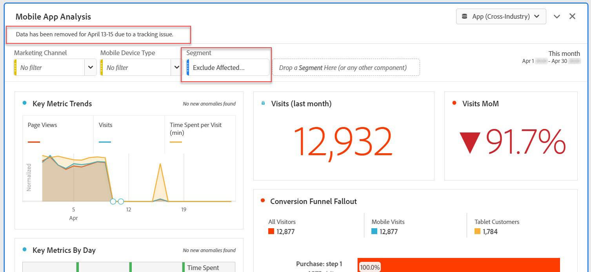

# Exclude specific dates in analysis

If you have data [impacted by an event](overview.md), you can use a segment to exclude any date ranges that you don't want to include in your reports. Segmenting out event-impacted dates can help prevent your organization from making decisions on partial data.

## Isolate affected days

Create a segment that isolates the affected day or date range. This segment is useful if you want to just focus on the problem days to see more information around its impact.

1. Open the segment builder by going to **[!UICONTROL Components]** > **[!UICONTROL Segments]**, then click **[!UICONTROL Add]**.
2. Drag the 'Day' dimension to the definition canvas, and set it equal to the day you want to isolate.
3. Repeat the above step for every day that you would like to isolate in your report.

>[!TIP]
>
>To change the OR statement to an AND statement, click the down arrow next to OR and select AND.

Adobe recommends using the orange dimension dimension components, and not the purple date range components. If you use purple date range components, they override the project's calendar range:

## Exclude affected days

Create a segment that excludes the affected day or date range. This segment is useful if you want to exclude the days that experienced issues to minimize impact on overall reporting.

1. Open the segment builder by going to **[!UICONTROL Components]** > **[!UICONTROL Segments]**, then click **[!UICONTROL Add]**.
2. In the upper right of the segment definition canvas, click **[!UICONTROL Options]** > **[!UICONTROL Exclude]**.
3. Drag the 'Day' dimension to the definition canvas, and set it equal to the day you want to remove.
4. Repeat the above step for every day that you would like to remove in your report.

## Use these segments in reports

Once you have the exclude segment created, you can use it exactly as you would use other segments.

### Compare segments in a trended report

You can apply both the 'Affected days' segment and 'Exclude affected days' segment in a report to compare them side-by-side. Drag both segments above or below a metric to compare them:

If you don't want to show zeros in your table or visualizations (causing dips), enable **[!UICONTROL Interpret zero as no value]** under column settings.

If you don't want to show zeros in your table or visualizations (causing dips), enable **[!UICONTROL Interpret zero as no value]** under column settings.

### Apply the exclude segment to a project

You can apply the 'Exclude affected days' segment to a Workspace project. Drag the exclude segment to the Workspace canvas section labeled *Drop a segment here*.

>[!TIP]
>
>Include a note around excluded data in the panel's description to help those viewing the report. Right click a panel's title, then click **[!UICONTROL Edit description]**.

### Use the exclude segment in a virtual report suite

You can use the segment in a [Virtual report suite](/help/components/vrs/vrs-about.md) to more conveniently exclude the data. This option is ideal in that you don't have to remember to apply the segment for each report that that includes the affected date range. If you already use virtual report suites as your primary source of data, you can add the segment to an existing VRS.

1. Navigate to **[!UICONTROL Components]** > **[!UICONTROL Virtual report suites]**.
2. Click **[!UICONTROL Add]**.
3. Enter the desired name and description for the virtual report suite.
4. Drag the exclude segment to the area labeled **[!UICONTROL Add segment]**.
5. Click **[!UICONTROL Continue]** in the upper right, then click **[!UICONTROL Save]**.

