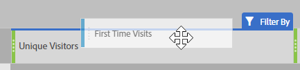
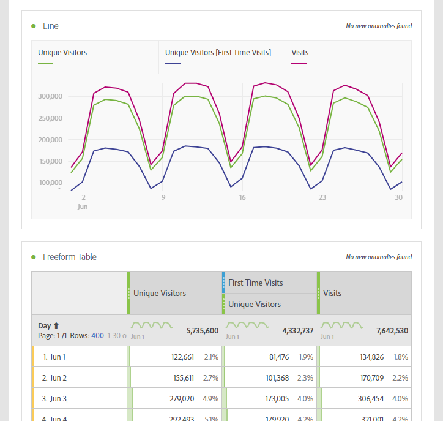

# Commonly used metrics on other platforms translation guide

On other platforms such as Google Analytics, many reports share a common number of metrics. Use this page to understand how to recreate the metrics used in many reports.

To add multiple metrics to a workspace freeform table, drag the metric from the components area next to the metric header in the workspace:

## Acquisition metrics

**Users** is approximately equal to **Unique Visitors** in Workspace. See the [Unique Visitors](/help/components/metrics/unique-visitors.md) metric in the Components user guide for additional details.

**New Users** can be obtained by the following:

1. Drag the **Unique Visitors** metric onto the workspace.
2. Drag the **First Time Visits** segment above the Unique Visitors metric headers:

    

**Sessions** is approximately equal to **Visits** in Analysis Workspace. See the [Visits](/help/components/metrics/visits.md) metric in the Components user guide for additional details.

## Behavior metrics

**Bounce Rate** is readily available in Analysis Workspace as a metric. See the [Bounce Rate](/help/components/metrics/bounce-rate.md) metric in the Components user guide for additional information.

**Pages/Session** is a calculated metric. It can be obtained by the following:

1. If you have already created this calculated metric, locate it under Metrics and drag it onto the workspace.
2. If you have not yet created this calculated metric, click the **+** icon near the metric list to open the Calculated Metric Builder.
3. Give it a title of 'Page views per visit', and a description if desired.
4. Set the format to Decimal, and set the number of decimal places to 2.
5. Drag the **Page views** metric and **Visits** metric into the definition area.
6. Arrange the definition so the formula is **Page Views divided by Visits**.

    

7. Click Save to go back to your workspace.
8. Drag the newly defined calculated metric onto the workspace.

    Learn more about [Calculated Metrics](/help/components/c-calcmetrics/cm-overview.md) in the Components user guide.

**Avg. Session Duration** is approximately equal to **Time Spent per Visit (seconds)**. Learn more about [Time spent per visit](/help/components/metrics/time-spent-per-visit.md) metrics in the Components user guide.

## Conversions metrics

**Goal Conversion Rate**, **Goal Completions**, and **Goal Value** require additional implementation on both platforms. If your implementation already accommodates the products dimension and purchase event, consider the following steps:

1. Drag the **Orders** metric, **Revenue** metric, and **Visits** metric onto the workspace.
1. Create a calculated metric of **Orders per Visit**. Use ctrl+click (Windows) or cmd+click (Mac) on both metric headers to highlight them. Right-click one of the headers, select **Create Metric From Selection**, then click **Divide**. This new metric is similar to a Goal Conversion Rate.
1. If decimal places are necessary, edit the Calculated Metric. Click the Info button in the metric header, then the pencil icon. Add 1 or 2 Decimal Places in the Calculated Metric Builder window, then click Save.

    

If your implementation does not yet accommodate product or conversion data, Adobe recommends working with an implementation consultant to ensure data quality and integrity.
