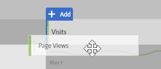

# Create a basic report in Analysis Workspace for Google Analytics users

Analysis Workspace (one of the main features within Adobe Analytics) provides a robust area for a user to gain any insight on collected data. Reporting is very different between Google Analytics and Adobe Analytics:

* The reporting structure in Google Analytics allows you to select a particular type of data, such as geo location or referral traffic. The platform uses a prefabricated reporting view based on the anticipated best way to view that data.
* The reporting structure in Analysis Workspace provides a blank canvas, providing more flexibility in meeting exact reporting needs.

Because Analysis Workspace works more like a canvas than prefabricated reports, recreating reports from Google Analytics is simply a matter of using the right visualizations and components.

## Key terms used in Workspace

* **Visualizations** are the most basic building blocks of workspace. Their purpose is to represent data in different formats. Most of the time that format is a table, but other times it can be other things like a donut or line chart. Many reports in Google Analytics are made of the equivalent of two visualizations: a line chart and freeform table.
* **Components** are placed in a visualization to return data. Components can be mixed in many different ways to meet reporting needs.
  * **Dimensions** are variable values, and typically contain text. Examples include page name, referrer, or geo country. They are most commonly listed as rows in a table.
  * **Metrics** typically signify an event of some sort. Examples include common events such as a page view, or something more significant like a purchase or registration. They are most commonly seen as columns in tables to show the number of times that event occurred per dimension.
  * **Segments** are a subset of your data, and behave similarly to segments in Google Analytics. They allow you to make customized filters, allowing you to focus on a specific part of your data.
  * **Date ranges** let you organize data by when the event occurred. They are the backbone of viewing trends over time, and are typically paired with a metric.

## Create a basic report in Workspace

Create an All Pages report (similar to the one in Google Analytics) by dragging the right components onto a workspace canvas.

1. Log in to [experiencecloud.adobe.com](https://experiencecloud.adobe.com) using your Adobe ID credentials.
2. Click the 9-square icon in the upper right, then click the colored Analytics logo.
3. In the top navigation bar, click Workspace.
4. Click the 'Create New Project' button.
5. In the modal popup, make sure 'Blank Project' is selected, then click Create.
6. On the left, a list of dimensions, metrics, segments, and date ranges is shown. Locate the Pages dimension (colored orange), and drag it onto the canvas labeled 'Drop a Dimension Here'.
7. A report showing the top pages for this month can be seen. Analysis Workspace automatically populates the report with the [Occurrences](../../../components/c-variables/c-metrics/metrics-occurrences.md) metric.
8. A table in Google Analytics typically contains 7-8 metrics. Locate the Bounce Rate metric (colored green), and drag it next to the Occurrences metric header. If you drag the Bounce Rate metric next to Occurrences, both metrics are displayed side-by-side.
9. Many metrics can be placed side-by-side by dragging metrics next to existing metric headers.

    

## Experiment with the tool

Since Analysis Workspace is a reporting tool, it has no impact on data collection. There are no repercussions to indiscriminately dragging components into a project to see what works. Drag different combinations of dimensions and metrics into your workspace project to see what is available to you.

If you accidentally drag an invalid component to your workspace project or would like to go back a step, press ctrl+Z (Windows) or cmd+Z (Mac) to undo the last action made. You can also start with a clean slate by clicking *[!UICONTROL Project] > [!UICONTROL New]* in the upper left menu.

## Understand what dimensions and metrics to use

If you are comfortable with Analysis Workspace and would like to recreate a specific report typically viewed in Google Analytics, locate the report on its respective page:

* [Real-Time reports](realtime-reports.md)
* [Audience reports](audience-reports.md)
* [Acquisition reports](acquisition-reports.md)
* [Behavior reports](behavior-reports.md)
* [Conversions reports](conversions-reports.md)