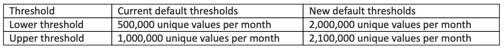

# Low-traffic value in Adobe Analytics

When a report has many unique values, Adobe provides functionality to ensure that the most important values appear in your report. Unique variable values collected beyond a certain threshold (see below) are listed under a dimension item labeled **[!UICONTROL Low-Traffic]**.

## How [!UICONTROL Low-Traffic] works

* Adobe Analytics uses two thresholds to determine which unique values are displayed in reports each month: A **[!UICONTROL low threshold]** and a **[!UICONTROL high threshold]**. These thresholds may be adjusted by Adobe from time to time. The current threshold limits are:
  * **[!UICONTROL Low threshold]**: >500,000 unique values during the month.
  * **[!UICONTROL High threshold]**: >1,000,000 unique values during the month.
* In **mid April 2024**, Adobe will begin increasing the default report suite low-traffic thresholds as follows:  
  This will impact only variables which are currently set below the new thresholds. These changes will be made incrementally, and we expect the work to be complete by the **end of May**. As these increases are rolled out, you may notice changes for high-cardinality variables:<ul><li>More dimension values may be available for reporting.</li><li>Segments and calculated metrics may include more data.</li><li>Virtual report suites based on segments may include more data.</li><li>Classification exports may include more data.</li></ul>
* Reporting is not affected if the variable does not reach the low threshold in a given month.
* When a variable reaches the low threshold, data begins to be bucketed under [!UICONTROL Low-Traffic]. Each value beyond this threshold goes through the following logic:
  * If a value is already seen in reports, add to that value as usual.
  * If a value is not yet seen in reports, it initially is bucketed in the [!UICONTROL Low-Traffic] dimension item.
  * If a value that is bucketed under [!UICONTROL Low-Traffic] receives an influx of traffic (typically instances in the double digits in a single day), it starts being recognized as its own dimension item. Instances collected before meeting the threshold remain under [!UICONTROL Low-Traffic]. The exact point at which the dimension item begins showing up in reports has many dependencies, such as the number of servers processing data for the report suite and the amount of time between each dimension item instance.
* If a variable reaches the high threshold, more aggressive filtering is applied. Unique values require instances in the triple digits in a single day before being recognized as its own dimension item.

This logic allows Adobe to optimize reporting capabilities while still allowing your organization to report on crucial dimension items collected later in the month. For example, if your organization runs a site with millions of articles and a new article becomes popular towards the end of the month (after exceeding both unique thresholds), you can still analyze the performance of that article without it being bucketed under [!UICONTROL Low-Traffic]. This logic is not intended to un-bucket everything that gets a certain number of page views per day or per month.

>[!NOTE]
>The [Page](../components/dimensions/page.md) dimension uses several backend columns that all count towards unique thresholds, including `pagename`, `page_url`, `first_hit_pagename`, `first_hit_page_url`, `visit_pagename`, `visit_page_url`, and `click_context`. These backend columns can cause [!UICONTROL Low-Traffic] logic to apply well before the number of unique Page dimension items in Workspace reaches the low threshold.

Note that the low-traffic logic described above works best with variables which have dimension items that recur many times during the month. If a variable's dimension items are nearly or entirely unique on every hit, the variable will reach the low threshold quickly and all new dimension items for the month will end up in the low-traffic bucket.

## Changing unique limit thresholds

Threshold limits can sometimes be changed on a per-variable basis. Contact Adobe Customer Care or your Adobe Account Team to request this change. The extent to which the thresholds can be increased depends on multiple factors and Adobe may not be able to accommodate threshold increases in all cases. When requesting a change, include:

* The report suite ID
* The variable you would like to increase the threshold for
* Both the first and second threshold desired

Changes to thresholds can impact report performance. Adobe highly recommends using good judgment when requesting an increase to unique values in a variable. Only increase unique limits for variables that are critical to your organization's reporting needs.

Low-traffic thresholds are not visible in the Analytics UI. Contact Adobe Customer Care if you would like more information on existing thresholds.

## Low-traffic using components and other capabilities

Different capabilities treat low-traffic values in different ways.

* **Data Warehouse:** There is no limit to the number of unique values in Data Warehouse reports. Its unique architecture allows the reporting of any number of unique values.
  * In some limited scenarios, low-traffic values can still appear. Examples include list vars, list props, merchandising eVars, and marketing channel detail dimensions.
* **Segmentation:** If the segment criteria includes a variable with a high number of unique values, values captured under low-traffic are not included.
* **Classifications:** Classification reports are also subject to unique limits. If a classification's parent variable value is included under low-traffic, the value is not classified.
  * Low-traffic classification values obtained through the importer can be viewed in Data Warehouse. <!-- AN-115871 -->
  * Low-traffic classification values obtained through the rule builder *cannot* be viewed in Data Warehouse. <!-- AN-122872 -->
