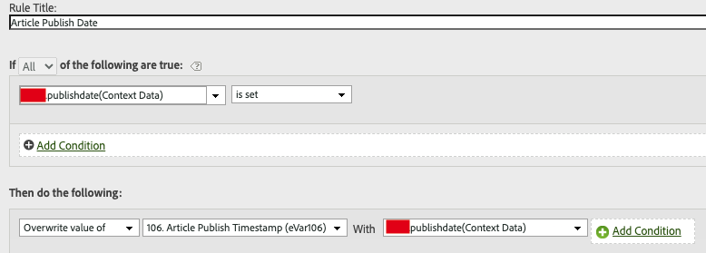
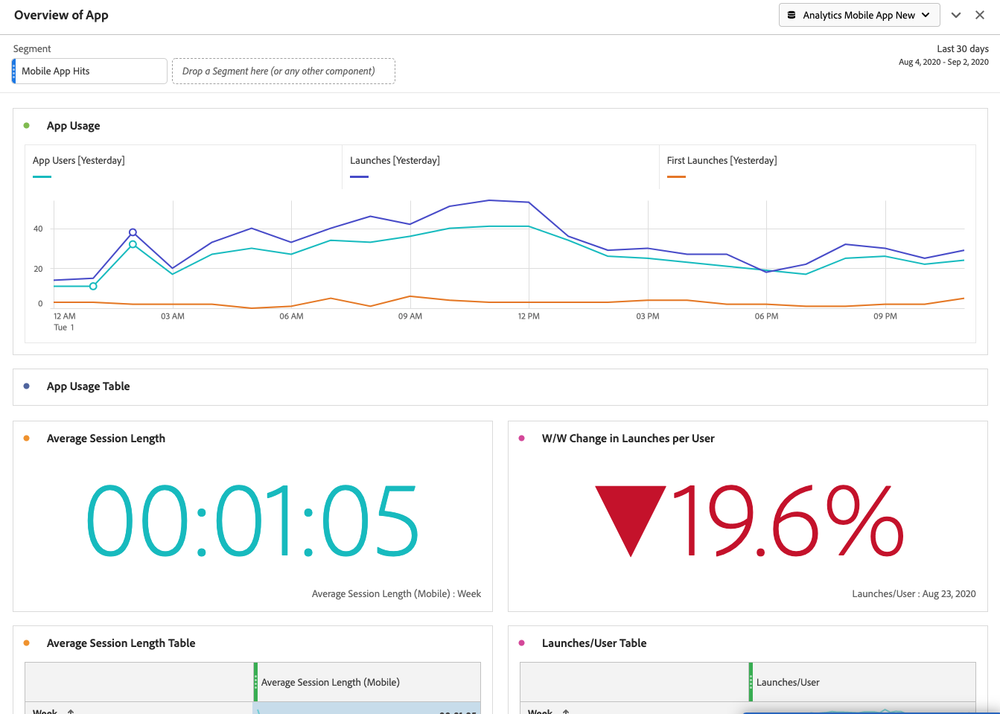

# Migrate Mobile Services processing rules to Adobe Analytics

With the upcoming (as yet unannounced) sunset of Adobe Mobile Services functionality, this document provides you with instructions on how to migrate any additional processing rules - beyond Lifecycle Metrics - that you created in the Mobile Services UI to Adobe Analytics. 

Processing rules are used to move values from context data variables to props and eVars. For example, you could place the value of a “search-term” context data variable into the value of a Commerce Variable eVar and overwrite that value on every hit. Without processing rules, context data variables are meaningless and do not populate any reports in Analytics.

This document also addresses mobile usage reporting in Analysis Workspace and discusses the feasibility of migrating other Mobile Services functionality.

## Migrate Processing Rules
 
If you are leveraging Mobile Services for complimentary functionality such as processing rules and usage reporting features, you can seamlessly move to the Analytics UI (processing rules UI or Analysis Workspace) to accomplish these functions. For Lifecycle Metrics, or rules that were set up in the AA processing rules UI, you don't have to do any migration. Lifecycle Metrics are "out-of-the-box" metrics that are automatically collected when the Mobile SDK is first implemented in your app. 

However, if you set up any additional processing rules in the Mobile Services UI (beyond Lifecycle Metrics), you should migrate those over so that you can edit/delete them in Analytics after you lose access to Mobile Services. 

1. Log in to experience.adobe.com and go to Mobile Services.
1. Click the gear icon of a mobile app whose context variable mappings you want to migrate to Adobe Analytics .
1. Click the **[!UICONTROL Manage Variables and Metrics]** menu item, then click the **[!UICONTROL Custom Variables]** tab. Here, you can see which Context Variable mappings (context data) have been added to the configuration. Make a note of these configurations (or take a screenshot.) Example:

    

1. In Experience Cloud, switch to Adobe Analytics and make sure you are in the same mobile report suite that you were looking at in Mobile Services.
1. Go to Admin > Report Suites >Edit Settings > General > Processing Rules.
1. Click Add Rule.
1. Ignore the conditions and proceed to add the same context variable/s that exist/s in Mobile Services.

    

## Mobile usage reporting in Analysis Workspace

In addition to mobile metrics and dimensions (if the report suite is enabled for Mobile Services), Analysis Workspace contains several Mobile project templates that can facilitate analysis:

* Messaging: Focuses on in-app and push messaging performance.
* Location: Includes a Map showcasing location data.
* Key Metrics: Keep a pulse on the key metrics of your app.
* App Usage: How many app users, launches, and first launches did the app have, and what was the average session length?
* Acquisition: How are mobile acquisition links performing?
* Performance: How is the app performing and where are users having problems?
* Retention: Who are my loyal users and what do they do?
* Journeys: What are the prominent usage patterns for my app?

Here is an excerpt of the Mobile App Usage template:

To access the templates:

1. Log in to experience.adobe.com and select Analytics.
1. Make sure you are in a report suite that is enabled for Mobile Services.
1. Click the Workspace tab.
1. Click Create New Project.
1. Select any of the Mobile templates and click Create.

## Migrate other Mobile Services functionality

The following Mobile Services functionality also has ties into Adobe Analytics, but requires a purchased Adobe Analytics SKU:

* Acquisition Links 
* Push Messaging 
* In-app Messaging 
* Location points-of-interest management 

If you are leveraging Mobile Services for paid functionality, you don’t have a viable migration path to other internal/external tools:

* For Acquisition Links, we can direct you to Adobe Partners to satisfy your need. 
* While flavors of Push Messaging and In-app Messaging are found in Adobe Campaign Standard and Adobe Campaign Classic (push only), the underlying data set used for targeting is different and no data or messaging activity migration is possible. 
* For Location functionality, you are encouraged to adopt the new [Adobe Experience Platform Location Service](https://www.adobe.com/experience-platform/location-service.html), which is free to all AEP customers.
