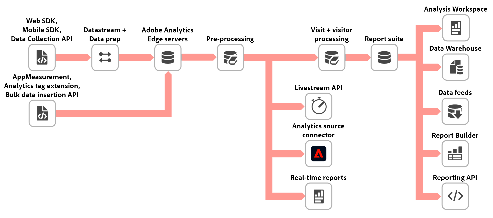

# Processing order for data in Adobe Analytics

Adobe offers many ways to alter or manipulate data before it appears in reporting. This page shows the order that various Adobe Analytics features process data. You can use this list to troubleshoot data inconsistencies, or determine the best feature to use when data adjustments are necessary.

## Data before it is sent to Adobe

Before data is sent to Adobe, it is typically compiled client-side using one of the following methods:

* **AppMeasurement**: A JavaScript file hosted on your site and referenced on each page. Data is sent directly to Adobe Analytics.
* **Adobe Experience Platform Web SDK**: A JavaScript file hosted on your site and referenced on each page. Data is sent to Adobe Experience Edge.
* **Tags in Adobe Experience Cloud Data Collection**: A JavaScript file referenced on each page, containing rules created within the Data Collection UI. The Adobe Analytics extension offers and easier way to implement AppMeasurement. The Web SDK extension offers an easier way to implement the Web SDK.

If you send data to Adobe Experience Edge, you can configure it to forward data to Adobe Analytics (as well as many other Adobe Experience Cloud solutions). Regardless of implementation method, ultimately an image request with the desired variables is sent to Adobe data collection servers.

## Data as it arrives to Adobe Analytics data collection servers

Once data arrives to Adobe Analytics, the following features adjust the data as needed:

1. **Lookup tables**: Dimensions that rely on Adobe-internal lookup tables (for example, the [Browser](/help/components/dimensions/browser.md) dimension) is matched to its corresponding value.
2. [**Dynamic variables**](/help/implement/vars/page-vars/dynamic-variables.md): If a dynamic variable is seen in any part of an image request, the value is copied over and treated as an independent value moving forward.
3. [**Bot rules**](/help/admin/admin/bot-removal/bot-rules.md): Apply standard or custom bot filtering to exclude that data from reporting.
4. [**Processing rules**](/help/admin/admin/c-processing-rules/processing-rules.md): Custom rules applied to your data by your organization. Includes the mapping of [Context data variables](/help/implement/vars/page-vars/contextdata.md) to its respective variable.
5. **VISTA rules**: Custom flexible rules applied to your data by an Adobe consultant. VISTA rules can potentially run before or after Processing rules, depending on your organization's needs. Most VISTA rules generally run after Processing rules, but each organization is set up differently. Contact your Adobe Account Manager for more information around existing VISTA rules.
6. [**Marketing Channel processing rules**](/help/components/c-marketing-channels/c-rules.md): You can use [Processing rules](/help/admin/admin/c-processing-rules/processing-rules.md) to prepare data for use in Marketing Channel processing rules.
7. **Geolocation data**: Dimensions that rely on IP address lookup (for example, the [Countries](/help/components/dimensions/countries.md) dimension) are populated.
8. [**IP obfuscation**](/help/admin/admin/general-acct-settings-admin.md): If your organization has opted to obfuscate IP addresses in raw data, it is done after all other processing functions have completed.

At this point, the individual hit is recorded in report suite data tables. After the standard [latency](latency.md) interval, it is available in reporting.

## Changing data after it is processed

Data in Adobe Analytics is mostly permanent; however, there are some features that can allow selective data adjustment or removal:

* [**Data repair API**](https://developer.adobe.com/analytics-apis/docs/2.0/guides/endpoints/data-repair/): Edit certain columns or delete desired rows of data.
* [**Data Governance**](/help/admin/c-data-governance/an-gdpr-workflow.md): Accommodate privacy requests to permanently delete data.
* [**Classifications**](/help/components/classifications/c-classifications.md): Create dimensions based on rules or uploaded data that allows you to organize data differently. The underlying report suite data is not changed, so you can freely edit or overwrite classification data.
* [**Virtual report suites**](/help/components/vrs/vrs-about.md): Create an alternate report suite view that can change the visit timeout, or allow [Cross-Device Analytics](/help/components/cda/overview.md).
